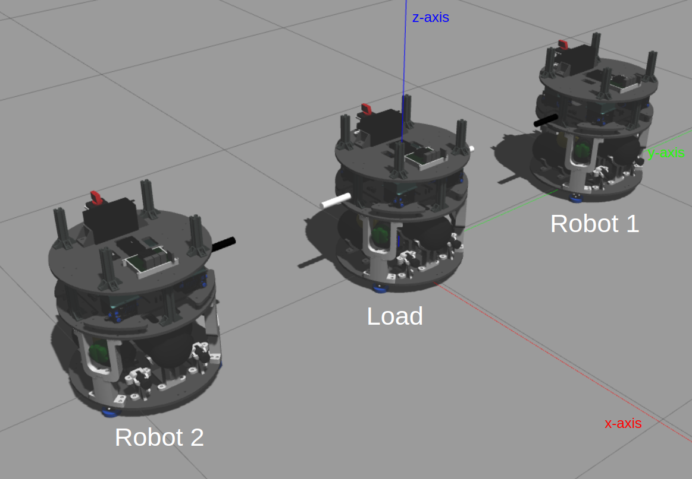

# Load Transportation Simulator
We present a simulator in Gazebo to simulate Multi-agent load transportation tasks in a microgravity environment. 

<div align="center">


**Fig. 1** Robot simulator
</div>

## Requirements
- ROS 2 Foxy
- Casadi 3.6.5
- Gazebo ROS2 Control plugin
- Gazebo Plugins

**NOTE**: this package was tested on a Ubuntu 22.04 LTS with the packages above mentioned. Different versions of Casadi and ROS 2 may work, but it is not guaranteed.

## Running Simulation
1. Clone the repository:
```bash
git clone git@github.com:DISCOWER/discower_transportation.git
```
2. Build the workspace:
```bash
colcon build --symlink-install
source install/setup.bash 
```
3. Start Gazebo simulation
```bash
ros2 launch discower_transportation launch_sim.launch.py 
```
4. Start PWM controller
```bash
ros2 run discower_transportation start_pwm_controller.py 
```
5. Run the Example controller.
This controller is a simple controller that moves the load forward.

```bash
ros2 run discower_transportation example_controller.py 
```

## Running [Transport MPC](https://github.com/pSujet/transport_mpc)

To run the Transport MPC controllers, instead of running the example in step 5, run the following command:

* Run centralized controller:
```bash
ros2 launch transport_mpc start_controller_cen.launch.py
```

* Run decentralized controller:
```bash
ros2 launch transport_mpc start_controller_decen.launch.py
```

## Restart Simulation
We can reset the simulator by stopping example_controller and pwm_controller. Next, pressing Ctrl + R in the Gazebo window. Then we can restart the cable position by launching the following command line:
```bash
ros2 launch discower_transportation set_initial.launch.py 
```

## Simulator
There are two robots and one load as shown in Fig. 1. The load is connected to the robots by cables. Each robot has four thruster pairs and is controlled by the PWM controller. Body wrench of each robot is calculated by the following equation:
```math
\mathbf{F} = \mathbf{D} \mathbf{u} =
\begin{bmatrix}
    F_x \\ F_y 
\end{bmatrix} = 
\begin{bmatrix}
1 & 1 & 0 & 0 \\
0 & 0 & 1 & 1
\end{bmatrix}
\begin{bmatrix}
u_1 \\ u_2 \\ u_3 \\ u_4
\end{bmatrix}
```

```math
\boldsymbol{\tau} = \mathbf{L}\mathbf{u} =
\begin{bmatrix}
    \tau_z
\end{bmatrix} = 
l_{arm}\begin{bmatrix}
1 & -1 & 1 & -1
\end{bmatrix}
\begin{bmatrix}
u_1 \\ u_2 \\ u_3 \\ u_4
\end{bmatrix}
```


